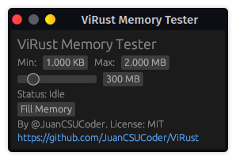

# ViRust Brutal Benchmarking


ViRust is a "benchmarking" tool or software that allows you to fill the desired amount of memory with random values, to see how your computer performs with limited RAM.

## Graphical User Interface



## Command Line Interface

```bash
ViRust Memory Filler

Usage: virust [COMMAND]

Commands:
  memory  Fills the random access memory to a desired amount
  gui     
  help    Print this message or the help of the given subcommand(s)

Options:
  -h, --help     Print help
  -V, --version  Print version
```

```bash
Fills the random access memory to a desired amount

Usage: virust memory [OPTIONS]

Options:
  -g, --gigas <GIGAS>  Gigas of RAM to be filled [default: 0]
  -m, --megas <MEGAS>  Megas of RAM to be filled [default: 0]
  -k, --kilos <KILOS>  Kilobytes of RAM to be filled [default: 100]
  -h, --help           Print help
```

### Example

```bash
$ RUST_LOG=INFO ./virust memory -m 10
```
```bash
 INFO  virust > Arguments: Arguments { commands: Some(Memory(MemoryArgs { gigas: 0.0, megas: 10.0, kilos: 100 })) }
 INFO  virust::subcommands::memory > Segments to Fill: 315628
 INFO  virust::subcommands::memory > Starting fill at 2023-06-18 17:01:26.782489577 -05:00
 INFO  virust::subcommands::memory > Tasks started after 0 ms, at 2023-06-18 17:01:26.782681049 -05:00
 INFO  virust::subcommands::memory > Finished after 278 ms, at 2023-06-18 17:01:27.060923054 -05:00
 INFO  virust::subcommands::memory > Bytes Filled: 10100100
 INFO  virust                      > Press any key to free the memory
```
